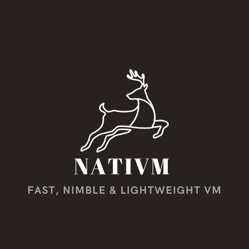

# NatiVM 
## Determinism at the Root Level

For the EOSIO project, the decision was to use WebAssembly as the blockchain's underlying engine. I believe this was ultimately a mistake that led to several problems for the project.

A few issues that exist currently is the upper bound of performance is always an issue, tooling is still very nascent, the spec moves too slowly, and lack of a guarantee of determinism at the root level of execution.

This article outlines a new novel solution for the underlying VM for Mandel blockchains.

## NatiVM High-Level Overview
NatiVM will first and foremost be a deterministic VM, minimization of  overheads of execution to near zero, high affinity for off-line compilation optimizations, MIT licensed, and the ability to inherit 40 years of tooling and expertise.

For Mandel we are utilizing WebAssembly (WASM) as the Intermediate Representation (IR) for the blockchain smart contract layer. NatiVM will instead use a subset of AMD64 I am calling Deterministic AMD64 as its VM architecture.

So instead of CDT or other toolchains producing WASM it will produce a binary that more closely matches the base architecture. This gives us a few benefits that will be expanded upon in more detail in the motivations section.

### Motivations
One issue with EOS-VM or any other VM technology is that we can't make the 100% guarantee that the kernel of running code (smart contract for Mandel) is purely deterministic. Code generation for interpreters, JITs and others can have bugs or patterns of instructions that elicit non-determinism. These also include EVM, etc.

I had originally sat down to solve how to ensure pure determinism at the VM layer and came to the conclusion that you have to validate the system specific code that is generated. This led to the realization that once we have done that we pretty much have built the majority of NatiVM.

When we look at WASM for Mandel, we have to own the VM technology, if not there is too much risk of non-determinism or divergent behavior between runtimes. Since we already need to own this particular part of the stack, why choose an off-the-shelf standard? 

Since we don't own the WASM standard and were disallowed to create extensions for things like exception support, the dynamic linkage between contracts, SIMD, etc. we've had to wait on those standards to be ratified. And to me, the pace of WebAssembly is way too slow for the pace of blockchain innovations. This decision of sticking to vanilla WASM was promoted as that we would benefit from a large ecosystem of systems and experts. This has not quite panned out the way that it was promoted. The tooling that exists is scant, and expertise in this technology is still very niche. Every new toolchain has to build almost every part from the ground up, any tooling such as static analyzers, dynamic analysis tools, profilers, etc. has to be built from the ground up. This puts a huge burden on the developers at ENF and the community as a whole.

The current system we have has 3 separate runtimes (eos-vm, eos-vm-jit, eos-vm-oc). This is actually more problematic than it is beneficial. The original motivation behind this was that we could support different tiers of usage or debug-ability, etc. And the main point that was made was that multiple backends were better because they would help highlight differences between the other backends. The issue with this way of thinking is that when we would find these differences we would have to pick one as the "standard" and force the others to support that. One of the backends is the "standard" by default and its behavior would win out across the others, so there is no real difference if we have one or many from a standpoint of bug discovery.

WASM itself is still a quite nascent technology and standard. If we look at CDT as an example and its underlying utilization of LLVM, the LLVM target for WebAssembly is still listed as an experimental target and as such tends to have much lower activity than the AMD64, ARM, PowerPC targets. If we look at AMD64 we have twenty-some years of experience and tooling already built and ready to go. If we look at LLVM, the AMD64 target is incredibly optimized for that architecture.

As also being the CDT guy, I've always been frustrated by the lack of overall support for WASM as a whole and the inefficient compilations. Now the argument could be made that we should focus efforts on fixing some of these issues at the fundamental compiler level, and while this is somewhat true there is always a floor that we would not be able to go beyond (read forward in the Technical Motivations section).

Given some rough example "benchmarks" (JSON parsing, some heavy crypto functions, and some embedded compute benchmarks) some of these were having a delta of upwards of 20x improvement when compiled for the native hardware.

## Technical Motivations
Static compilation inefficiencies. If we look at compiling C++ (really any language) to a target we have a few stages to go through.

 1. Parsing (Syntactic Analysis)
 2. Semantic Analysis
 3. IR Generation (including SSA form in this)
 4. Optimization Passes on IR
 5. Lower of IR to concrete target specific instructions
 6. Some target specific optimizations
 7. Assembly of that generated target code.

The first two phases will generate valuable metadata and attributes for the steps 4–6. This metadata can be things like type information, constness, visibility, etc. This metadata is used for most of the more critical optimization passes and analysis. One example is alias analysis, a lot of compilers utilize type based alias analysis which implies strong type information to be present. There are field sensitive analyses that would suffer from missing type information. Alias analysis is an incredibly critical analysis that a considerable amount of optimization passes rely on.

Now when we compile to something like WASM we lose all of this information. So when we try to WASM compile to AMD64 or any other architecture there is a loss of detail that you can't easily reconstitute and for some we will never be able to reconstitute it. This means that there is always a boundary that we can't get through with WASM.

In addition to this LLVM/Clang can't make certain assumptions about the target and has insufficient instruction weighting, branch weighting, and no real instruction rescheduling. These are major pieces of compilation to allow for quality instruction selection, branch reordering and rescheduling in the basic blocks and rescheduling loads and stores and other instructions to take advantage of the underlying architecture.

Since AMD64 and ARM64 are modern superscalar architectures proper branch optimizations (pipeline invalidations) and instruction rescheduling (getting the most out of ILP) are critical to performance.

There is yet another issue with WASM that exists which is that it is a stack based architecture (albeit a non-standard one). Another big area that compilers typically handle is quality register allocation. If done poorly this can have massive impacts on the overall performance of the compiled code. If you look at something like Java Dalvik or Android Run Time (ART), they added the concept of registers to Java (another stack based vm) to get the performance out of it.

WASM claims that it is immune to 'return oriented programming' attacks are impossible but Stivenart, et.al found this to untrue and insufficient for security risk mitigation (The Security Risk of Lacking Compiler Protection in WebAssembly).

## NatiVM Details
The IR of Deterministic AMD64 will be a proper subset of AMD64. This will allow for CDT/Anvil to compile and generate either a smart contract binary or a regular shared object file. The shared object file will be run in a 

 - The standard for NatiVM will be an open standard.
 - The licensing will be MIT.
 - Deterministic AMD64 will be a proper subset of AMD64 and therefore perfectly compatible with preexisting AMD64 machines.
 - Future (v2 or beyond) will introduce Deterministic ARM64 as these machines become more ubiquitous.

## Beyond VM
Because we are targeting AMD64, CDT or ANTLER should produce two binaries for consumption. One is the binary for smart contract deployment on the blockchain. The other is a regular shared object with DWARF information for debugging with LLDB/GDB. A small 'loader' will be available to load these 'libraries' as smart contracts and through "side-car" debugging with nodeos allow for succinct debugging, testing and quick running of these.

### Side-car Debugging
In nodeos a new plugin will be developed to expose the host functions via RPC calls, the ability to halt at a given block and forward action data to a "redirected" account.

What this will allow is the ability for CDT/ANTLER to build a debugging driver and testing framework to utilize the RPC calls. This will allow for the ability to test smart contracts without having to require C++.

The ability to stop at a block and "forward" the action data will be incredibly useful for smart contract devs to post mortem debug on chain actions.

### The Rest of The World
We will be able to utilize premade tooling such as LLVM's static analysis tools and dynamic analysis tools. A plethora of preexisting tools will be immediately usable because of the usage of the shared object and driver architecture.